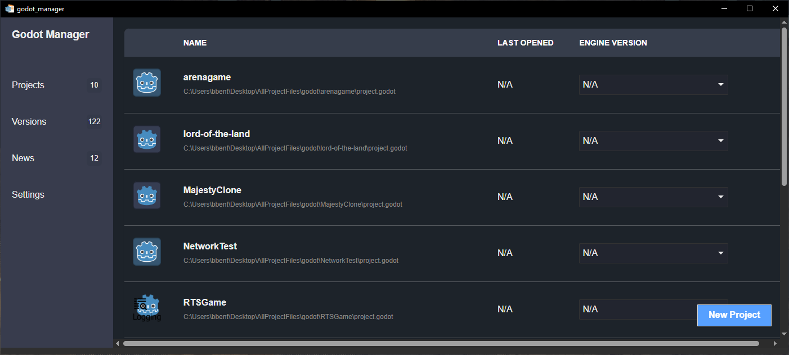
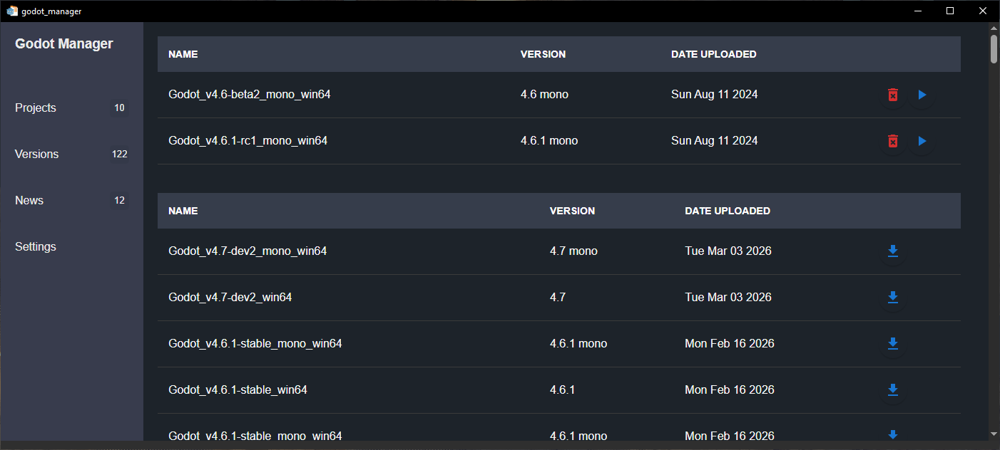

# Godot Project Manager

Desktop app for managing **Godot engine versions** and **local Godot projects** from one place.

Built with **Tauri v2 + React + TypeScript + Rust**.

---

## What this project does

Godot Project Manager helps you:

- Discover available Godot releases (filtered for Windows builds)
- Download and extract engine versions locally
- Track folders that contain your Godot projects
- Scan those folders for `project.godot` files
- Assign a specific installed engine version to each project
- Launch either an engine directly or a project with its assigned engine
- View recent Godot news in-app

---

## Screenshots

### Main Projects View



<!-- TODO: Replace with real screenshot of the project list + launch controls -->

### Engine Versions View



<!-- TODO: Replace with real screenshot of installed/available engines + download progress -->

### Settings View


<!-- TODO: Replace with real screenshot of tracked project paths -->

---

## Feature highlights

### 1) Project management
- Reads tracked directories from config
- Scans for Godot projects
- Shows project icon/name/path and last-opened date
- Lets you map each project to an installed engine version

### 2) Engine management
- Fetches available Godot releases from GitHub
- Displays installed vs available versions
- Downloads and extracts new engines
- Shows live download progress
- Supports deleting installed versions

### 3) Launch workflows
- Launch a selected project with its assigned engine
- Launch an engine directly (including for creating new projects)

### 4) News feed
- Scrapes and displays entries from the official Godot blog

---

## Tech stack

### Frontend
- React 18 + TypeScript
- Vite
- MUI + CSS Modules
- Tauri JS APIs (`invoke`, dialog, shell)

### Backend (Tauri/Rust)
- Tauri 2
- Tokio async runtime
- `reqwest` for remote fetching
- `scraper` + `regex` for parsing Godot news page
- `zip-extract` for engine archive extraction
- `directories` for OS config storage paths

---

## Project architecture

### Frontend entry
- `src/App.tsx` orchestrates initial loading, page routing, and Tauri command calls.

### UI pages
- `Projects`: manage and launch discovered projects
- `Versions`: install/remove/launch Godot engine versions
- `News`: read latest Godot blog posts
- `Settings`: add/remove directories to scan for projects

### Backend command layer
Tauri commands are registered in `src-tauri/src/main.rs`, including:

- `get_engine_versions`
- `download_engine_version`
- `get_installed_versions`
- `remove_installed_version`
- `get_all_projects`
- `save_project_path` / `remove_project_path`
- `set_engine_version_for_project`
- `open_project` / `open_engine`
- `get_news_entries`

### Persistent data
Config is stored under your OS config directory (in a `godot_project_manager` folder), with:

- tracked project directories
- tracked project metadata
- tracked engine metadata

---

## Getting started

### Prerequisites

- Node.js (LTS recommended)
- pnpm (`packageManager` is pinned to pnpm)
- Rust toolchain
- Tauri prerequisites for your OS

### Install dependencies

```bash
pnpm install
```

### Run in development

```bash
pnpm tauri dev
```

### Build frontend only

```bash
pnpm build
```

### Build desktop app

```bash
pnpm tauri build
```

---

## Usage flow

1. Open **Settings** and add one or more root directories containing Godot projects.
2. Go to **Projects** to confirm discovered projects.
3. Open **Versions** and install the engine versions you need.
4. Back in **Projects**, assign each project to an installed engine.
5. Launch projects directly from the table.

---

## CI / Release

GitHub Actions is configured to build and publish Tauri bundles for:

- macOS (Apple Silicon + Intel)
- Linux (Ubuntu)
- Windows

See: `.github/workflows/build.yaml`

---

## Notes

- Current engine release filtering is set up for Windows assets.
- The app window is configured with a wide desktop-first layout.

---


